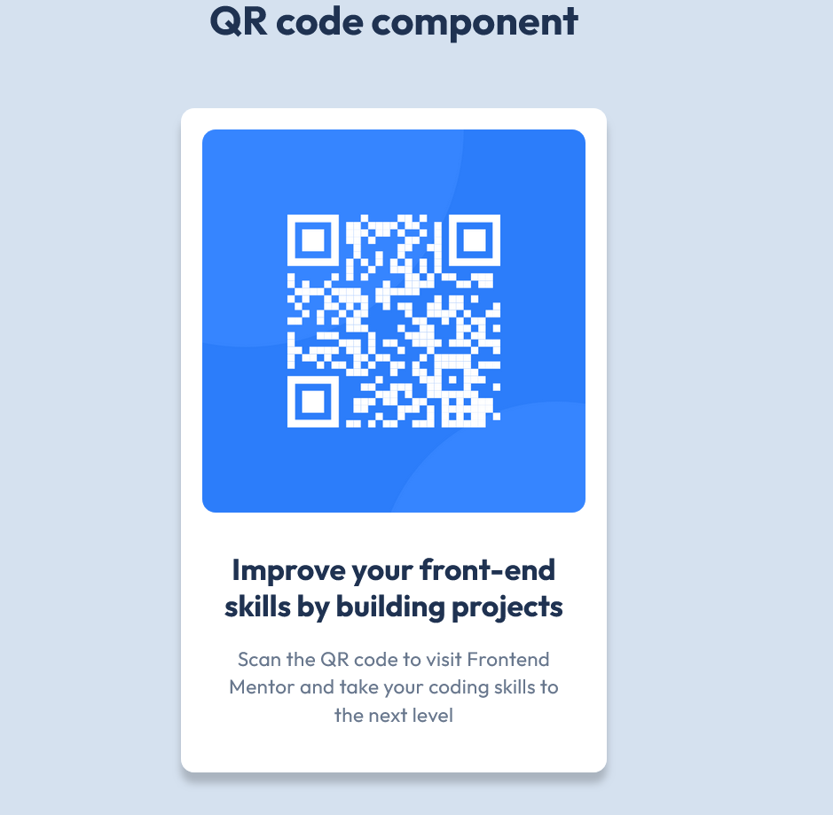

# Frontend Mentor Challenge - QR code component

This is my solution to the [QR code component challenge](https://www.frontendmentor.io/challenges/qr-code-component-iux_sIO_H) on Frontend Mentor.

## Overview

:point_right:[Here's the Link](https://yahappygrace.github.io/frontend-mentor-practice/QR-code-component/index.html):smiley:

## Lessons learned

My first challenge on Frontend Mentor! :tada:

Although the challenge itself wasn't that hard, but I spent a lot of time figuring out how to use these tools :dizzy_face:

- **Figma**

  - **Inspecting Nested elements**: Ctrl + Click on the target element
  - **Accessing to the Local Variables modal**: You need to **_deselect everything_** _(by pressing Esc)_, or the section would not appear on the right sidebar!
  - **Measuring spacings**: select an element, press Alt and hover to another element.
  - **Other useful Keyboard shortcuts**
    - **Zoom to fit**: Shift + 1
    - **Zoom to the selected element**:Shift + 2
    - **Zoom to 100%**: Shift + 0 or Ctrl + 0

- **Git/Github**

  - **Use "main" as your local repo branch name**:
    - **git branch -M main**: Change your local repo branch name to "main" before pushing to Github. **_OR_**
    - **git config --global init.defaultBranch main**: Set "main" as your local repo default branch name.
      > :pencil:_Github had changed default branch name from "master" to "main" since 2020_
  - **Deploy with Github-pages**: repo must be **_public_**!

- **Markdown**
  - **Just get familiar with the syntax**: Markdown is actually quite user-friendly! The struggling part was coming up ideas :joy:
  - **Preview your markdown files**: Download **_Markdown Preview Enhanced_** extension on VScode

## Useful Resources

- [Figma for developers](https://www.frontendmentor.io/articles/figma-for-developers-how-to-work-with-a-design-file-m6CZKZ1rC1)
- [Markdown Cheat Sheet](https://www.markdownguide.org/cheat-sheet/)
- [Markdown Emoji](https://gist.github.com/rxaviers/7360908) :point_left:My favorite part of writing Markdowns!! :laughing: :laughing:
